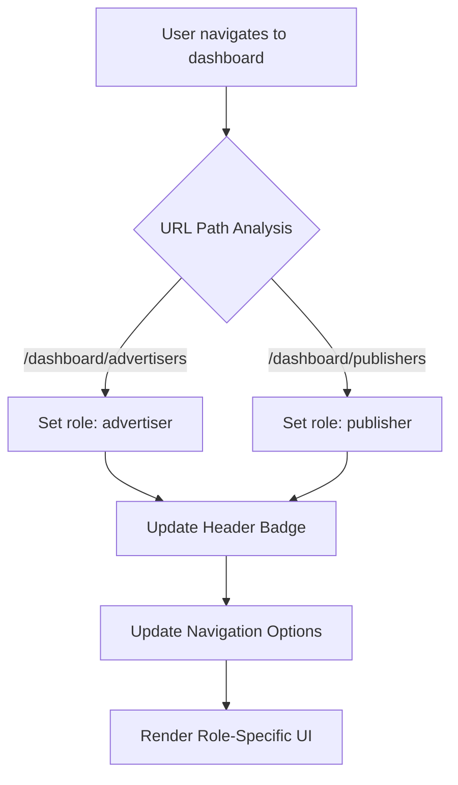
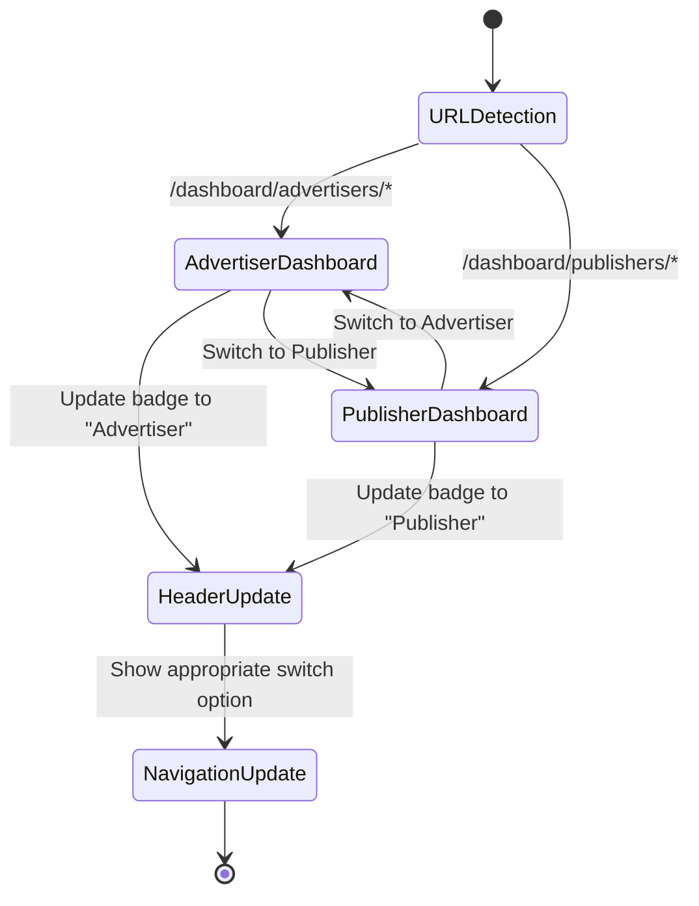
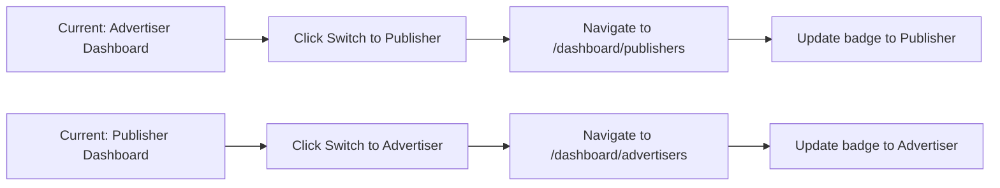

# Dashboard Role Indicator Fix

## Overview

The dashboard role indicator system has a critical bug where the profile badge displays the wrong user type when switching between advertiser and publisher dashboards. Additionally, users get stuck and cannot switch back to their previous role after attempting to switch. This creates a broken user experience and prevents proper role-based navigation.

## Problem Analysis

### Current Implementation Issues

1. **Hardcoded Role Display**: The `DashboardHeader` component hardcodes "Advertiser" in the profile dropdown, regardless of the actual user role or current dashboard context.

2. **No Dynamic Role Detection**: The system lacks dynamic role detection based on the current URL path or user context.

3. **Missing Role Switching Logic**: While there's a "Switch to Publisher" option in the header dropdown, there's no corresponding "Switch to Advertiser" option when viewing the publisher dashboard.

4. **Inconsistent Role State**: The desktop sidebar correctly shows the user type, but the header profile badge doesn't synchronize with it.

### Code Evidence

In `DashboardHeader.tsx`:
```tsx
<p className="text-xs text-neutral-500 dark:text-neutral-400">Advertiser</p>
```
This is hardcoded and doesn't reflect the actual user type or dashboard context.

In `DesktopSidebar.tsx`:
```tsx
<div className="text-xs text-neutral-500 dark:text-neutral-400 capitalize">
  {userType}
</div>
```
This correctly displays the dynamic user type but only in the sidebar.

## Architecture Requirements

### Role Detection Strategy



### Component State Synchronization



## Technical Solution

### 1. Dynamic Role Detection

Implement URL-based role detection in the `DashboardHeader` component:

| URL Pattern | Detected Role | Badge Display | Switch Option |
|-------------|---------------|---------------|---------------|
| `/dashboard/advertisers/*` | advertiser | "Advertiser" | "Switch to Publisher" |
| `/dashboard/publishers/*` | publisher | "Publisher" | "Switch to Advertiser" |

### 2. Header Component Enhancement

The `DashboardHeader` needs these modifications:

- **Add pathname detection**: Use `usePathname()` to determine current dashboard type
- **Dynamic role display**: Replace hardcoded "Advertiser" with dynamic role based on URL
- **Bidirectional switching**: Add both "Switch to Publisher" and "Switch to Advertiser" options
- **Conditional menu items**: Show role-appropriate navigation options

### 3. Navigation Logic



### 4. Component Interface Updates

#### DashboardHeader Props Enhancement
```typescript
interface DashboardHeaderProps {
  balance: number;
  userType?: "advertiser" | "publisher"; // Optional explicit override
}
```

#### Role Detection Hook
```typescript
const useCurrentUserType = () => {
  const pathname = usePathname();
  return pathname.includes('/dashboard/publishers') ? 'publisher' : 'advertiser';
};
```

## Implementation Specifications

### File Modifications Required

1. **`src/components/dashboard/DashboardHeader.tsx`**
   - Add pathname-based role detection
   - Replace hardcoded "Advertiser" text
   - Add bidirectional switching logic
   - Update dropdown menu items conditionally

2. **Role Detection Logic**
   - Implement URL pattern matching
   - Handle edge cases for nested routes
   - Ensure consistent behavior across all dashboard pages

### Settings Menu Consistency

The settings dropdown should also reflect the current role:

| Current Dashboard | Settings Link |
|-------------------|---------------|
| Advertiser | `/dashboard/advertisers/settings` |
| Publisher | `/dashboard/publishers/settings` |

### User Experience Improvements

1. **Clear Visual Feedback**: The badge should immediately update when switching roles
2. **Consistent Navigation**: Both header and sidebar should show the same role information
3. **Intuitive Switching**: Users should always see the option to switch to the other role
4. **No Dead Ends**: Users should never get stuck in one role without the ability to switch back

## Testing Strategy

### Test Cases

| Scenario | Expected Behavior |
|----------|------------------|
| Navigate to `/dashboard/advertisers` | Badge shows "Advertiser", menu shows "Switch to Publisher" |
| Navigate to `/dashboard/publishers` | Badge shows "Publisher", menu shows "Switch to Advertiser" |
| Click "Switch to Publisher" from advertiser dashboard | Navigate to publisher dashboard, badge updates |
| Click "Switch to Advertiser" from publisher dashboard | Navigate to advertiser dashboard, badge updates |
| Deep link to `/dashboard/advertisers/campaigns` | Badge correctly shows "Advertiser" |
| Deep link to `/dashboard/publishers/channels` | Badge correctly shows "Publisher" |

### Edge Case Handling

- Invalid dashboard URLs should default to advertiser role
- Missing pathname should gracefully fallback to advertiser
- Navigation between nested routes should maintain correct role display

## Validation Criteria

### Success Metrics

1. **Role Accuracy**: Badge always displays the correct role based on current dashboard
2. **Switching Functionality**: Users can successfully switch between roles in both directions
3. **Visual Consistency**: Header badge matches sidebar role display
4. **Navigation Reliability**: No broken navigation states or dead ends
5. **URL Synchronization**: Role display accurately reflects the current URL path

### Error Prevention

- Eliminate hardcoded role references
- Implement proper fallback handling for edge cases
- Ensure all navigation paths include bidirectional switching options
- Validate that role switching works from any dashboard page, not just the main overview

This fix will resolve the user's issue where they switched to the publisher dashboard but the indicator still showed "advertiser" and they couldn't switch back. The solution provides a robust, URL-based role detection system with proper bidirectional navigation.