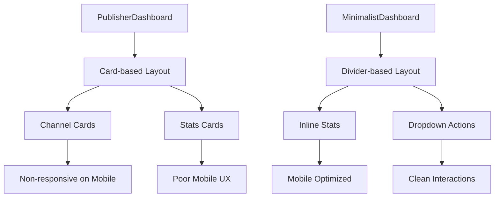
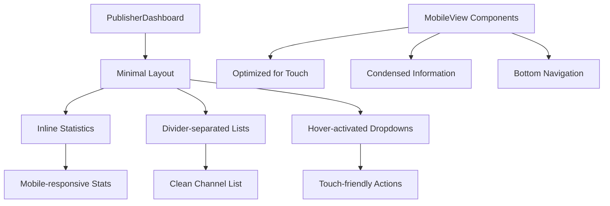

# Publisher Dashboard Mobile Responsiveness & Minimal Design Implementation

## Overview

This design addresses the mobile responsiveness issues in the publishers dashboard and implements the minimal design approach consistent with the advertisers dashboard. The current publisher dashboard uses card-based layouts that are not mobile-friendly and inconsistent with the established minimal design principles used for advertisers.

## Technology Stack & Dependencies

- **Framework**: Next.js 15.4.6 with App Router
- **UI Components**: React 19.1.0 with shadcn/ui components
- **Styling**: Tailwind CSS with mobile-first responsive design
- **Animations**: Framer Motion 12.23.12 for smooth transitions
- **Icons**: Tabler Icons for consistent iconography

## Component Architecture

### Current Architecture Issues



### Target Architecture



## Component Definitions

### Core Components to Refactor

#### 1. PublisherDashboard Component
**Current Issues:**
- Uses card-based layout with poor mobile responsiveness
- Stats display in separate card containers
- Channel listings lack mobile optimization
- Actions scattered across different UI elements

**Proposed Improvements:**
- Adopt divider-based layout from MinimalistDashboard
- Implement inline statistics similar to advertiser dashboard
- Use hover-activated dropdown menus for actions
- Optimize spacing and typography for mobile screens

#### 2. Channel Listing Component
**Design Pattern:**
```
Channel Name + Status Badge
Niche Category • Subscribers • Rating • Price
──────────────────────────────────────────────
[Hover Dropdown: View, Edit, Pause/Resume]
```

**Mobile Optimization:**
- Condensed information display
- Touch-friendly action buttons
- Responsive grid for stats
- Collapsible details on smaller screens

#### 3. Earnings Summary Component
**Layout Structure:**
```
Wallet Icon | Available Balance: $1,250.50
            | [Withdraw Funds Button]
──────────────────────────────────────────────
Quick Actions Dropdown
──────────────────────────────────────────────
```

## Routing & Navigation

### Mobile Navigation Pattern
- Consistent with existing `MobileBottomNav` structure
- Tab-based navigation: Overview, Earnings, Settings
- Floating Action Button for "Add Channel"
- Responsive breakpoints: `sm:hidden` for mobile-only views

### Desktop Navigation
- Sidebar navigation maintained
- Header with balance display
- Breadcrumb navigation for sub-pages

## Styling Strategy

### Responsive Design Principles

```css
/* Mobile-first approach */
.dashboard-container {
  @apply max-w-7xl mx-auto space-y-8 sm:space-y-12 pb-24 sm:pb-8;
}

.stats-inline {
  @apply flex flex-wrap justify-center gap-4 sm:gap-8 text-sm;
}

.channel-item {
  @apply group flex items-center justify-between p-4 
         hover:bg-neutral-50 dark:hover:bg-neutral-900/50 
         rounded-lg transition-colors duration-200;
}

.divider {
  @apply border-t border-neutral-200 dark:border-neutral-800;
}
```

### Typography Scale
- **Mobile Headings**: `text-2xl` (32px) for main titles
- **Desktop Headings**: `text-4xl` (56px) for main titles
- **Stats Values**: `text-xl sm:text-2xl` responsive scaling
- **Body Text**: `text-sm sm:text-base` responsive scaling

### Spacing System
- **Mobile Padding**: `px-4 py-6` for content areas
- **Desktop Padding**: `sm:px-6 lg:px-8 py-6 lg:py-8`
- **Component Spacing**: `space-y-4 sm:space-y-6` responsive gaps

## State Management

### Channel Management State
```typescript
interface ChannelState {
  channels: Channel[];
  loading: boolean;
  error: string | null;
  selectedChannel: string | null;
}

interface Channel {
  id: string;
  name: string;
  niche: string;
  subscribers: number;
  engagement_rate: number;
  rating: number;
  price_per_post: number;
  status: "active" | "paused" | "pending_review" | "suspended";
  new_orders: number;
  total_orders: number;
}
```

### Mobile Tab State
```typescript
interface MobileState {
  activeTab: "overview" | "earnings" | "settings";
  isMenuOpen: boolean;
  showActions: boolean;
}
```

## API Integration Layer

### Publisher Dashboard Endpoints
```typescript
// Fetch publisher data
GET /api/dashboard/publishers
Response: {
  channels: Channel[];
  transactions: Transaction[];
  balance: number;
  analytics: PublisherAnalytics;
}

// Channel management actions
POST /api/channels
PUT /api/channels/:id
DELETE /api/channels/:id
```

### Error Handling
- Graceful fallback to demo data on API failures
- Loading states with skeleton components
- Error boundaries for component failures

## Component Hierarchy

### Desktop Layout Structure
```
DashboardLayout
├── DesktopSidebar
├── DashboardHeader
└── PublisherDashboard
    ├── HeroSection (inline stats)
    ├── QuickActionsDropdown
    ├── ChannelsList (divider-separated)
    └── RecentTransactions
```

### Mobile Layout Structure
```
DashboardLayout
├── DashboardHeader (condensed)
├── MobileTabContent
│   ├── PublisherDashboard (overview)
│   ├── MobileEarningsView
│   └── MobileSettingsView
└── MobileBottomNav
```

## Props/State Management

### PublisherDashboard Props
```typescript
interface PublisherDashboardProps {
  channels: Channel[];
  transactions: PublisherTransaction[];
  balance: number;
  onAddChannel: () => void;
  onWithdraw: () => void;
  onViewChannel: (id: string) => void;
  onEditChannel: (id: string) => void;
  onToggleChannel: (id: string, action: "pause" | "resume") => void;
}
```

### Mobile View Integration
```typescript
interface MobileViewProps {
  activeTab: string;
  onTabChange: (tab: string) => void;
  showMobileNav: boolean;
}
```

## Lifecycle Methods/Hooks

### Data Fetching Pattern
```typescript
useEffect(() => {
  const fetchPublisherData = async () => {
    setLoading(true);
    try {
      const response = await fetch('/api/dashboard/publishers');
      const data = await response.json();
      
      if (response.ok) {
        setChannels(data.channels);
        setTransactions(data.transactions);
        setBalance(data.balance);
      } else {
        // Fallback to demo data
        setDemoData();
      }
    } catch (error) {
      setDemoData();
    } finally {
      setLoading(false);
    }
  };
  
  if (user) {
    fetchPublisherData();
  }
}, [user]);
```

### Responsive Hook Usage
```typescript
const useResponsive = () => {
  const [isMobile, setIsMobile] = useState(false);
  
  useEffect(() => {
    const checkScreen = () => {
      setIsMobile(window.innerWidth < 640);
    };
    
    checkScreen();
    window.addEventListener('resize', checkScreen);
    return () => window.removeEventListener('resize', checkScreen);
  }, []);
  
  return isMobile;
};
```

## Testing Strategy

### Component Testing Approach
- **Unit Tests**: Jest for component logic testing
- **Integration Tests**: React Testing Library for user interactions
- **Visual Regression**: Storybook for component variations
- **Responsive Testing**: Viewport testing across breakpoints

### Mobile-Specific Testing
```typescript
describe('PublisherDashboard Mobile', () => {
  it('should display condensed stats on mobile', () => {
    render(<PublisherDashboard {...props} />);
    // Test mobile-specific layouts
  });
  
  it('should show touch-friendly action buttons', () => {
    // Test mobile interaction patterns
  });
  
  it('should handle responsive breakpoints correctly', () => {
    // Test responsive behavior
  });
});
```

### Accessibility Testing
- Keyboard navigation support
- Screen reader compatibility
- Touch target size validation (minimum 44px)
- Color contrast compliance

## Implementation Phases

### Phase 1: Layout Restructuring
1. Remove card-based layouts from PublisherDashboard
2. Implement divider-based channel listing
3. Add inline statistics display
4. Update responsive breakpoints

### Phase 2: Mobile Optimization
1. Enhance mobile-specific views
2. Optimize touch interactions
3. Improve typography scaling
4. Add mobile navigation improvements

### Phase 3: UI Polish & Testing
1. Add hover states and micro-interactions
2. Implement loading and error states
3. Comprehensive responsive testing
4. Performance optimization

## Responsive Breakpoints

### Tailwind CSS Breakpoints
```css
/* Mobile First Approach */
.responsive-container {
  /* Mobile: 0-639px */
  @apply px-4 py-6 space-y-4;
  
  /* Small: 640px+ */
  @apply sm:px-6 sm:py-8 sm:space-y-6;
  
  /* Large: 1024px+ */
  @apply lg:px-8 lg:py-8;
}

.stats-display {
  /* Mobile: Stacked stats */
  @apply flex flex-wrap justify-center gap-4;
  
  /* Desktop: Horizontal stats */
  @apply sm:gap-8;
}
```

### Component-Specific Responsive Rules
- **Channel Cards**: Remove on mobile, use divider-separated lists
- **Action Buttons**: Stack vertically on mobile, horizontal on desktop
- **Stats Display**: Condensed grid on mobile, inline on desktop
- **Navigation**: Bottom tabs on mobile, sidebar on desktop

## Performance Considerations

### Optimization Strategies
- **Code Splitting**: Dynamic imports for mobile-specific components
- **Image Optimization**: Next.js Image component with responsive sizing
- **Bundle Size**: Tree-shaking unused UI components
- **Rendering**: Server-side rendering for initial page load

### Mobile Performance
- Touch event optimization
- Smooth scrolling implementation
- Gesture handling for interactive elements
- Battery-efficient animations

## Migration Strategy

### Backward Compatibility
- Maintain existing API contracts
- Gradual component replacement
- Feature flag for new design
- Rollback capability

### Data Migration
- No database changes required
- Component prop interface updates
- State management refactoring
- Event handler adjustments